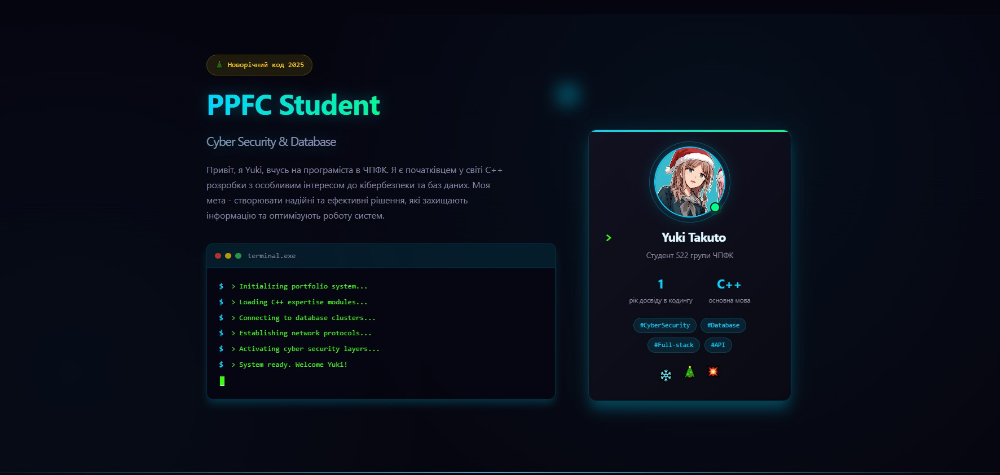

  

  

  <pre style="
    display: inline-block;
    background: #0d1117;
    color: #00ff9d;
    padding: 18px 24px;
    border-radius: 12px;
    font-size: 15px;
    width: auto;
    max-width: 480px;
    box-shadow: 0 0 20px rgba(0,255,153,0.25);
    text-align: left;
    margin: 0 auto;
    font-family: Consolas, 'Courier New', monospace;
  ">system status check...
> user: <strong>Yuki Takuto</strong>
> role: <strong>Developer / Cybersecurity Learner</strong>
> environment: <strong>Matrix Mode Enabled</strong>
> state: <strong>Online — fully operational</strong>
> portfolio: <strong>available via widget ↑</strong>
> action: <strong>click to enter the system</strong></pre>

